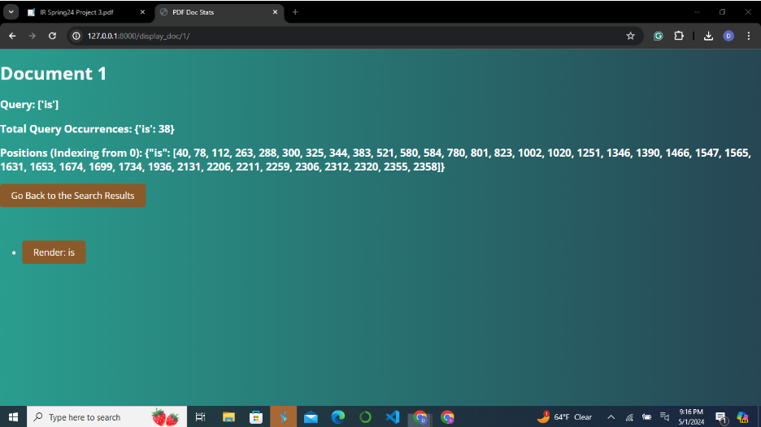
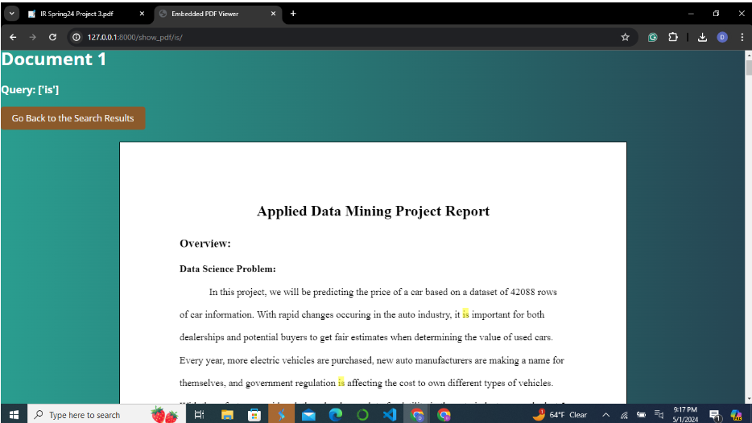
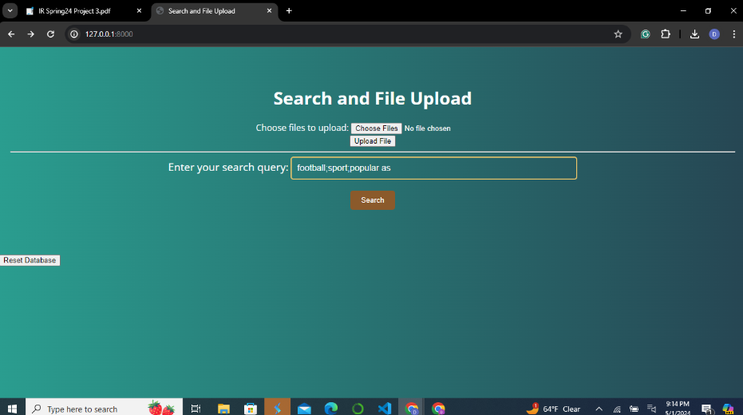
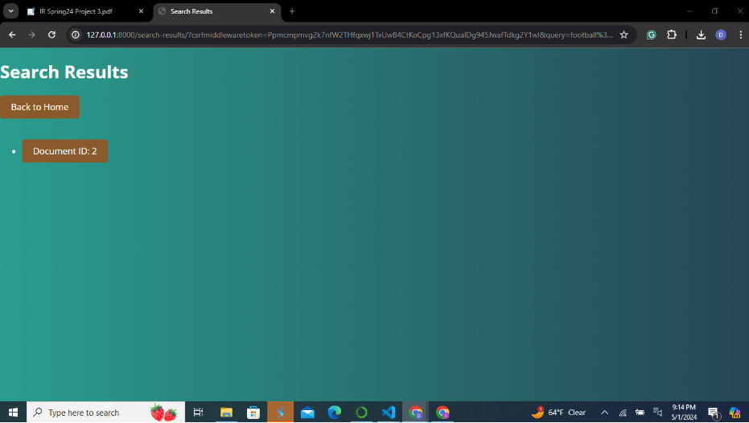
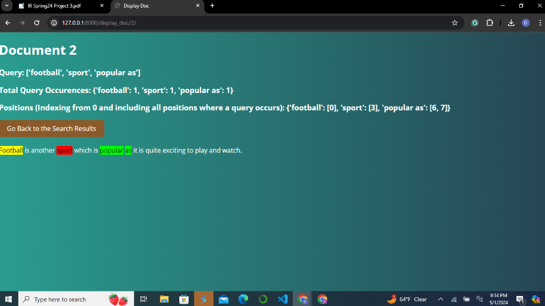
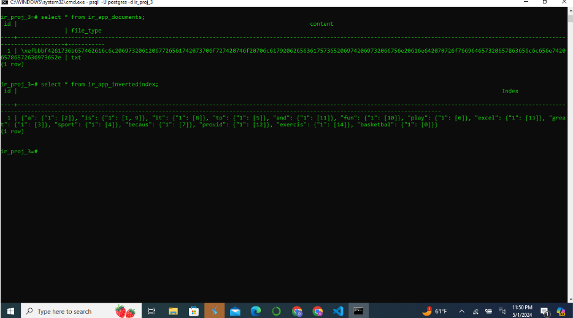

# Introduction:

This project uses topics and previous work from information retrieval to create a web application that works similar to a search engine. 
We leveraged Django and PostgreSQL to create the project. Django allows for easy frontend to backend integration and PostgreSQL 
was chosen because it can handle large volumes of data and it pairs seamlessly with Django. The primary objectives of this project were to develop a usable web interface and implement advanced indexing 
techniques to construct a good document viewing experience for the user and display relevant statistics. This readme explains a considerable portion of the 
project from installation, feature implementation, testing, deployment, and a demo at the end. For enhanced explanations and details, feel free to view the 
inline comments within the code itself.

## Installation Guide:
We have a guide below on how to install the system and run it on a different machine. Run the following commands in a terminal to access our application:
The following are required for the project:

  - Python
  - Django (https://www.djangoproject.com/download/)
  - PostegreSQL (https://www.postgresql.org/download/)

Step 1: Setting up Django project:

    git clone <repository-url>
    
    cd path/to/project

Step 2: Installing project dependencies:

    pip install -r requirements.txt

Step 3: Configure Postgres Database:

Locate ‘settings.py’ file in the project directory. Search for the database section in this file and alter it to match PostgreSQL your setup. Note: must have existing PostegreSQL Database running

Step 4: Run Migration

    python manage.py make migrations
    python manage.py migrate
    
Step 5: Run server

    python manage.py runserver
    
Step 6: Access server

Click the link from the output of the previous command to access the application.

## Features and Functionalities:

**Uploading Documents:**

Our application provides a user-friendly interface where you can upload documents. After being uploaded, each document is processed through the backend where an inverted index is created which is then stored in a PostgreSQL database. This constantly up to date  positional inverted index is critical because it enables the system to perform efficient searches across the uploaded documents. We regard this as one of our pinnacle features.

**Supported File Formats:**

Our application can handle a variety of file formats, including PDF, DOCX, and TXT. This flexibility allows users to upload documents in a convenient format.

**Searching Documents:**

Once documents are uploaded and indexed, you can perform searches using the query interface provided on the website. This feature supports various types of queries to enhance your search experience:

- Single Word Queries
- Multi-Word Queries
- Multiple Queries at Once:

**Viewing Search Results:**

Once a query is submitted, the system displays a list of documents where the search terms were found. Each entry in the search results provides basic document metadata such as the filename, and an option to go deeper into the content.

**Document Investigation:**

Clicking on a document in the search results will open a viewer where the relevant terms are highlighted in different colors. This allows the user to locate terms easily and maintains the original formatting and layout of the document. For PDFs, this means that the original pagination, graphics, and typesetting are preserved.

**Benefits of Our System:**

- Efficiency: The use of an inverted index reduces the time needed to search documents dramatically, making it ideal for handling large volumes of data.
- Accuracy: The search algorithm makes sure that users receive relevant results.
- User Experience: Even users with minimal technical knowledge can effectively upload documents and perform complex searches.
- Preservation of Document Integrity: Unlike some systems that alter the visual format of texts during processing, our system maintains the original appearance of all documents.

## Technical Architecture Overview

### Backend

Using the Django framework, these are the main components of the project and their associated files:

- manage.py: used for command-line utility to interact with the Django project. 

- settings.py: used to configure various settings including database configuration, installed apps, static files, etc.

- urls.py: used to define URL declarations for the Django project – essentially mapping between URL patterns to views. These URls include ‘upload’, ‘search_results’, ‘display_doc’, etc.

- models.py: used to define data models used in the application. Models include invertedIndex and documents

- views.py: contains logic and workflow for handling requests and returning responses. This acts as the middleman between the models and template. Contains the following functions:
    
      preprocess_documents()
      find_documents_test()
      get_binary()
      get_pos_index()
      file_upload_view()
      reset_database()
      search_results_test()
      display_doc_test()
      display_doc()

- static/ and template/: These directories contain all javascript, HTML, and CSS files. This contains all code for the frontend of the application.

- requirements.txt: includes all necessary imports to run the program. Key modules include nltk, PyMyPDF, PyPDF2 and sqlparse, among others.

### Frontend:

- HTML: Structures the web content and is used to define elements on the web page.
- CSS: Manages the visual presentation, styles, and layout of the web page.
- JavaScript: Adds interactivity to the web pages, handling tasks such as sending asynchronous requests to the server (AJAX), manipulating the DOM, and updating the user interface in real-time. We leveraged PDF.js to support PDF rendering and text highlighting. Feel free to view the inline comments in views.py for more information regarding the usage of this library.

## Interaction Flow

  1. User Actions: Users interact with the frontend through forms and buttons, performing actions like uploading documents or entering search queries.
  2. Request Handling: When an action is taken (e.g., a form submission), JavaScript can make asynchronous requests to the backend without needing to reload the page, enhancing user experience.
  3. Data Processing: Django views receive these requests and interact with models to process data. For uploads, documents are stored, and indexes are created. For searches, queries are processed against the inverted index in PostgreSQL.
  4. Response Generation: The backend processes the request and sends back the relevant data to the frontend, where JavaScript updates the web page dynamically based on the received data.

## Demo:

**Homescreen:**

**Positional Index for query 'is':**

**PDF Functionality and Visualization:**

**Text File Query:** 

Database Functionality:

## Performance Metrics Evaluated

**Response Time:** When constructing our application, we considered the time taken to return search results after a query is submitted, an element which is crucial for user satisfaction.

**Resource Utilization:** When running the application, we monitored the usage of system resources like CPU, memory, and disk I/O during normal operation and peak loads in an effort to gauge the viability of the application in this regard.

## Future Work:

**Scalability Plans:** How can the system be scaled to handle more simultaneous users or massive files?

**Feature Extensions:**  New features such as advanced search options, integration with other data sources, or improvements in user interface design.

**Security Enhancements:** Additional security measures like implementing OAuth for user authentication or encryption more data elements.

Technology Upgrades: Looking forward to integrating newer technologies or frameworks that could improve system performance or user experience like react , Node.js and servers to handle large data load.

## Acknowledgements

Advisors and Mentors: Professor Munsub Hafiz Ali and some of the references related to NLP and python Programming.

## Team Members:

Adam Cersosimo

Dan Cersosimo

Krishianjan Lanka

Owen Hovey

Vincert Ranieri
